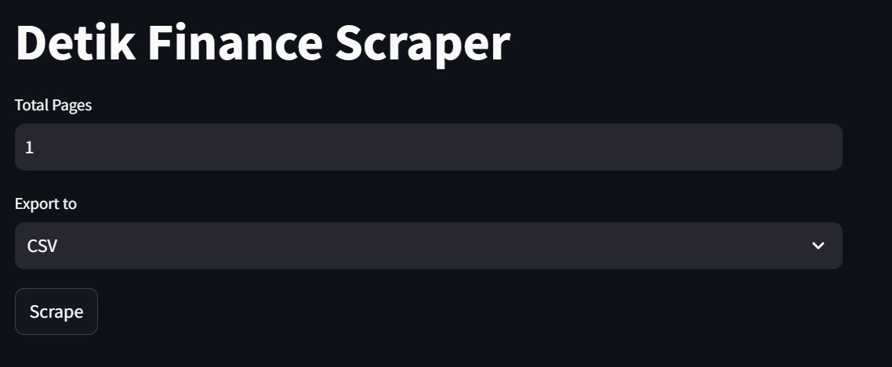
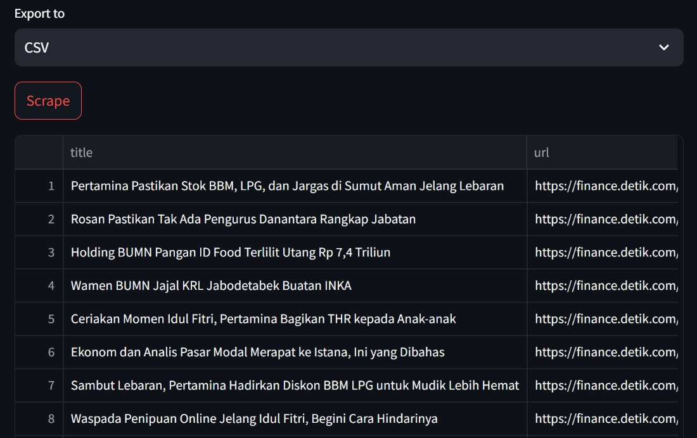

# Detik Finance News Scraper
---------------

A web scraper for finance.detik.com, allowing users to search and export news articles by total pages.


## Screenshots
-------------

### Detik Finance News Scraper


### Search Results


## Features
--------

* Specify the total number of pages to scrape
* Export results to CSV, JSON, or XLSX files

## Installation
------------

1. Clone this repository by entering the following command:
```
git clone https://github.com/PutraAlFarizi15/Detik-Finance-News-Scraper.git
```
2. Once the git clone process is complete, navigate to the project folder:
```
cd Detik-Finance-News-Scraper
```
3. Create a virtual environment inside the project folder:
```
python -m venv venv
```
4. Activate the virtual environment using the following command:
```
venv\scripts\activate
```
5. If the virtual environment is activated, install the required libraries using the requirements.txt file:
```
pip install -r requirements.txt
```
6. Running Scraper app:
```
streamlit run scraper.py
```

## Usage
-----

1. Run the scraper using the command `streamlit run scraper.py`
2. Select the total number of pages to scrape
3. Choose the export format (CSV, JSON, or XLSX)
4. Click the "Scrape" button to start the scraping process